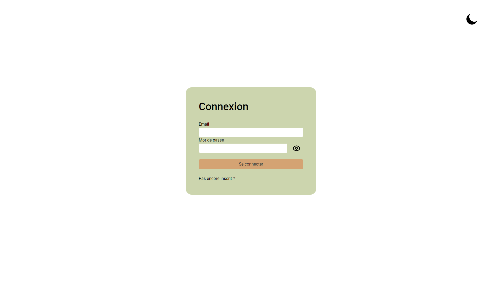
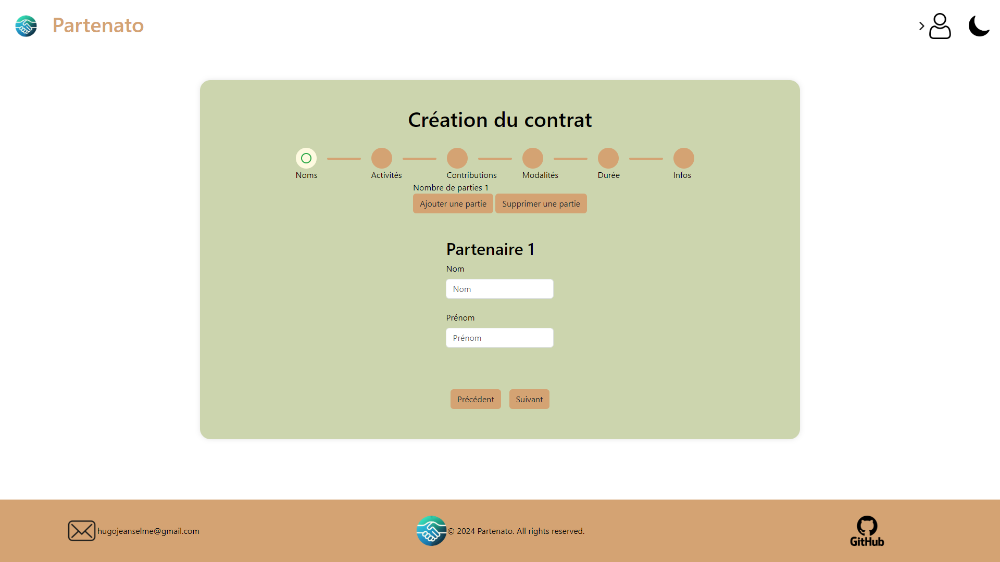

# 📜 Gestion des Contrats de Partenariat

Une application Laravel complète pour la gestion des contrats de partenariat, avec des fonctionnalités avancées telles que la signature électronique, la gestion des comptes utilisateurs et la génération de PDF. L'interface est moderne, responsive et agrémentée d'animations CSS et JavaScript.

---

## 🌟 Fonctionnalités

### 🔒 Gestion des utilisateurs
- **Création de compte** avec vérification par e-mail.
- **Connexion sécurisée** pour accéder aux fonctionnalités.
- Modification et mise à jour des informations du compte.

### ✍️ Gestion des contrats
- **Création de contrats** avec un éditeur intuitif.
- **Signature électronique** des contrats directement dans l'application.
- **Modification** et **suppression** des contrats existants.
- **Téléchargement des contrats en PDF** pour un usage hors ligne.

### 💻 Interface utilisateur
- **Design moderne et responsive** grâce à Bootstrap.
- **Animations CSS et interactions JavaScript** pour une expérience utilisateur fluide et agréable.

---

## 📂 Technologies utilisées

### 🛠 Backend
- **Laravel** : Framework PHP pour une gestion robuste et sécurisée.

### 🎨 Frontend
- **Bootstrap** : Mise en page élégante et responsive.
- **CSS/Animations** : Effets visuels modernes.
- **JavaScript** : Fonctionnalités interactives.

### 📄 PDF
- **Génération de PDF** : Conversion des contrats en documents téléchargeables.

### ✉️ Vérification e-mail
- **Validation des comptes utilisateurs** via un système d'e-mails sécurisé.

---

## 🚀 Installation

### Prérequis
- XAMPP (PHP 8.0 ou supérieur, MySQL).
- Composer.
- Node.js (pour la compilation des assets frontend).

### Étapes
1. Clonez le dépôt :
   ```bash
   git clone https://github.com/ton-utilisateur/ton-projet.git
   cd ton-projet
   ```

2. Déplacez le projet dans le répertoire `htdocs` de XAMPP.

3. Installez les dépendances backend :
   ```bash
   composer install
   ```

5. Configurez le fichier `.env` :
   - Base de données : `DB_DATABASE`, `DB_USERNAME`, `DB_PASSWORD`.
   - SMTP pour l'envoi des e-mails.

6. Démarrez Apache et MySQL depuis le panneau de contrôle XAMPP.

7. Migratez et seed les données :
   ```bash
   php artisan migrate --seed
   ```

8. Accédez à l'application :
   - Ouvrez [http://localhost/ton-projet/public](http://localhost/ton-projet/public) dans votre navigateur.

---

## 📸 Aperçu

<p align="center">
  
  
</p>

---

## 📄 Licence
Ce projet est sous licence **MIT**. Consultez le fichier `LICENSE` pour plus d'informations.

---

## 👨‍💻 Auteur
**Hugo Jeanselme**  
Passionné de développement web.
